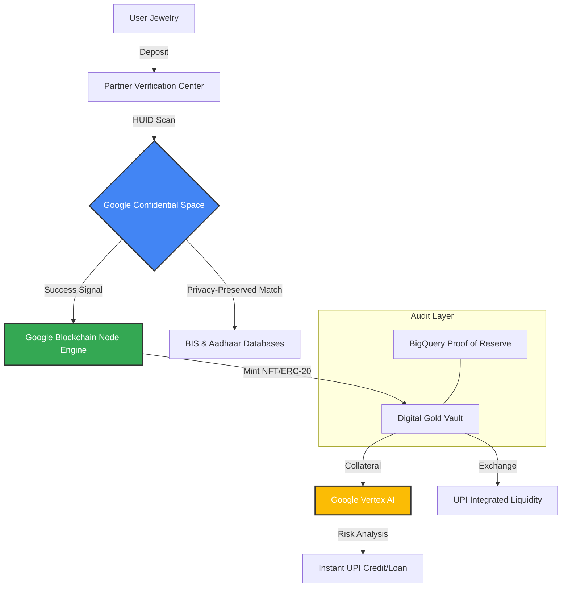

# 🏆 Vault-Tokens: Bridging India's "Dead Gold" to the Digital Economy

**"Transforming stagnant ornaments into liquid capital through HUID-certified RWA tokenization."**

Vault-Tokens is a "Phygital" Real-World Asset (RWA) platform that unlocks India’s **$1.5 Trillion** pool of idle household gold. By merging the Government’s **HUID (Hallmark Unique ID)** system with a high-performance **Google Cloud-powered blockchain**, we provide instant liquidity and credit for the everyday Indian.

---

## 🏗 System Architecture

The following diagram illustrates the flow from physical asset deposit to digital liquidity:



---

## 🚀 Key Features

* **HUID-to-NFT Bridge:** Every ornament is cryptographically linked to its Bureau of Indian Standards (BIS) Hallmarked ID.
* **Fractional Liquidity:** Own and trade gold in denominations as small as **0.01 grams**.
* **Instant UPI Credit:** Use your "Digital Vault" as collateral for immediate, low-interest micro-loans.
* **Zero-Knowledge Privacy:** User data is processed in hardware-isolated enclaves, ensuring total privacy.

---

## 🛠 Google Technology Stack

| Technology | Purpose |
| --- | --- |
| **Google Confidential Space** | Secures the HUID/Aadhaar verification in a "Black Box" environment, ensuring RBI-compliant data privacy. |
| **Blockchain Node Engine** | Provides dedicated Polygon/Ethereum nodes for 99.9% uptime and UPI-speed transaction finality. |
| **Vertex AI** | Powers the **Smart LTV** engine, calculating real-time loan risks based on global gold volatility. |
| **BigQuery & Looker** | Generates a live **Proof of Reserve (PoR)** dashboard for radical transparency of vaulted assets. |

---

## 📖 Technical Workflow

1. **Verification:** The physical ornament is scanned for its **HUID**.
2. **Enclave Processing:** **Google Confidential Space** pulls HUID data from the BIS database and verifies ownership via Aadhaar without exposing the data to the platform.
3. **Tokenization:** Upon verification, the **Blockchain Node Engine** triggers a smart contract to mint a unique **Vault-NFT** (sentimental) or **GoldGrams** (liquid).
4. **Activation:** The user can instantly access credit or sell fractions of their gold through the app’s UPI gateway, with risk managed by **Vertex AI**.

---

## 📈 Impact

* **For Individuals:** Converts "Dead Assets" into active credit tools.
* **For the Economy:** Injects up to **$150 Billion** of productive liquidity into the digital ecosystem.
* **For Industry:** Transitions traditional jewelers into digital asset custodians.

---

## 🛠 Getting Started

### Prerequisites

* Google Cloud Project with **Confidential Computing** enabled.
* Access to **Google Blockchain Node Engine** (Polygon/Mainnet).
* Vertex AI API credentials.

### Installation

1. Clone the repository:
```bash
git clone https://github.com/your-username/vault-tokens.git

```


2. Install dependencies:
```bash
npm install

```


3. Set up your `.env` with Google Cloud Service Account keys.

